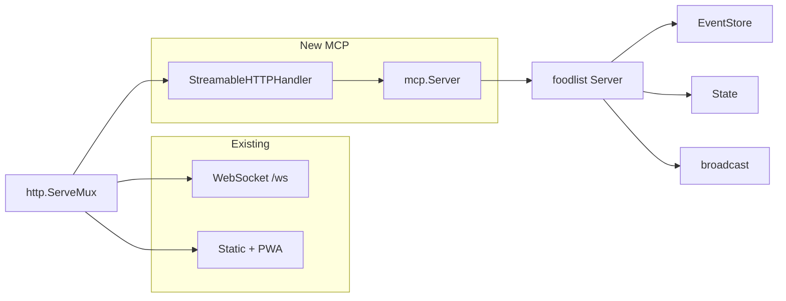

<!-- 35ca1d1a-151d-465d-9ede-e7bbf3a09d3d -->
# MCP Server for Foodlist Backend

## Current state

- **Backend**: Go app in `backend/` with `main.go` starting an HTTP server and a WebSocket server.
- **Server** (`backend/server.go`): Holds `EventStore`, `State`, WebSocket clients; handles commands (CreateTodo, CompleteTodo, CreateCategory, etc.) via `ParseCommand` → `commandToEvent` → `store.Append` → `state.ApplyEvents` → broadcast.
- **Operations**: 13 command types (todo + category CRUD, list title), plus autocomplete and read state (todos, categories, list title).

## Architecture

- **Same process, same HTTP server**: Mount the MCP handler on the existing `ServeMux` (e.g. at `pathPrefix + "mcp"`).
- **Shared state**: The MCP server will use the same `*Server` (EventStore + State) as the WebSocket path. Writes from MCP tools will persist events and broadcast to WebSocket clients so the UI stays in sync.

## Implementation steps

### 1. Add Go MCP SDK dependency

- In `backend/go.mod`: add `github.com/modelcontextprotocol/go-sdk` (use a recent stable tag, e.g. `v1.x`).
- Run `go mod tidy`.

### 2. Expose command execution and broadcast on `Server`

- **File**: `backend/server.go`
- Add **`BroadcastEvent(event Event) error`**: marshal event with `MarshalEvent`, send to `s.broadcast` (non-blocking send or small buffer); return nil or error if marshal fails.
- Add **`ExecuteCommand(cmd Command) error`**: call existing `commandToEvent(cmd)`; if nil/error return; then `store.Append(event)`, `state.ApplyEvents([]Event{event})`, `BroadcastEvent(event)`. This centralizes the “run one command and update everyone” flow so WebSocket and MCP share it.

### 3. Create MCP server and register tools/resources

- **New file**: `backend/mcp.go` (or `backend/mcp_server.go`)
- **Import**: `github.com/modelcontextprotocol/go-sdk/mcp`
- **Create MCP server**: `mcp.NewServer(&mcp.Implementation{Name: "foodlist", Version: version}, nil)` (reuse existing `version` from main).
- **Store reference**: Keep a reference to the foodlist `*Server` (passed when building the MCP handler).

**Resources (read-only)**

- **Resource** `foodlist:///state`: return JSON of current state: `todos` (from `state.GetTodos()`), `categories` (from `state.GetCategories()`), `listTitle` (from `state.GetListTitle()`). Register with `mcp.AddResource` and a handler that reads from state and returns JSON content.

**Tools (one per mutation)** — each tool parses arguments, builds the corresponding `Command` struct, calls `server.ExecuteCommand(cmd)`, and returns success or error text.

- `create_todo` — name (required), id (optional, generate UUID if missing), categoryId (optional), sortOrder (optional).
- `complete_todo`, `uncomplete_todo` — id.
- `star_todo`, `unstar_todo` — id.
- `reorder_todo` — id, sortOrder.
- `rename_todo` — id, name.
- `categorize_todo` — id, categoryId (optional/null to unset).
- `create_category` — name (required), id (optional), sortOrder (optional).
- `rename_category` — id, name.
- `delete_category` — id.
- `reorder_category` — id, sortOrder.
- `set_list_title` — title.

Use the SDK’s tool signature: `func(ctx, *mcp.CallToolRequest, InputStruct) (*mcp.CallToolResult, OutputStruct, error)`. Map `InputStruct` fields from `req.Params.Arguments` (e.g. JSON schema tags). Return content as text (e.g. "OK" or error message).

**Optional**: Add an **autocomplete** tool: arguments `query` string; call `server.getAutocompleteSuggestions(query)` and return suggestions as JSON text (so the model can use it when suggesting items).

### 4. Wire Streamable HTTP handler into main

- **File**: `backend/main.go`
- After creating the foodlist `server` and calling `LoadEvents()`:
  - Build the MCP server (function or helper in `mcp.go` that takes `*Server` and returns `*mcp.Server` with all tools and resources registered).
  - Create handler: `mcpHandler := mcp.NewStreamableHTTPHandler(getServer, opts)`. `getServer` is `func(*http.Request) *mcp.Server { return mcpServer }` (single shared MCP server). `opts` can be nil or set e.g. `Logger: slog.Default()`.
  - Register route: `mux.Handle(pathPrefix + "mcp", mcpHandler)` (or `"/mcp"` if you prefer; if using pathPrefix, keep it consistent with the rest of the app so secret path applies).
- Ensure the MCP endpoint is subject to the same middleware (e.g. logging, IP whitelist) as the rest of the app if desired.

### 5. Config / docs (optional)

- **Config**: If you want the MCP path or enable/disable flag, add env vars to `Config` in `main.go` and use them when registering the handler.
- **README**: Add a short section describing the MCP endpoint (URL, transport: streamable HTTP), and that it exposes the same operations as the WebSocket API so AI clients can manage the list.

## Design choices

- **Streamable HTTP**: The Go SDK’s `StreamableHTTPHandler` is the current standard and fits “same server” deployment; no separate process or stdio.
- **Single MCP server instance**: One `*mcp.Server` per process is enough; `getServer` returns it for every request so all MCP clients see the same state.
- **ExecuteCommand + BroadcastEvent**: Keeps a single code path for applying commands and notifying WebSocket clients, so MCP and UI stay consistent.
- **Tools vs resources**: Mutations as tools; read-only state as a resource keeps the protocol clear and avoids duplicate logic.

## Files to add/change

| File | Action |
|------|--------|
| `backend/go.mod` | Add `github.com/modelcontextprotocol/go-sdk` |
| `backend/server.go` | Add `BroadcastEvent`, `ExecuteCommand` |
| `backend/mcp.go` (new) | MCP server setup, tool handlers, state resource |
| `backend/main.go` | Create MCP server, mount `StreamableHTTPHandler` at MCP path |

## Testing

- Manual: run the server, point an MCP client (e.g. Cursor, or a small Go client using the SDK’s client) at `http://localhost:8080/<path>/mcp`, list tools/resources, call a few tools and read the state resource; confirm events persist and WebSocket clients receive updates.
- Optional: unit tests for `ExecuteCommand` and for MCP tool handlers with a fake in-memory store.
